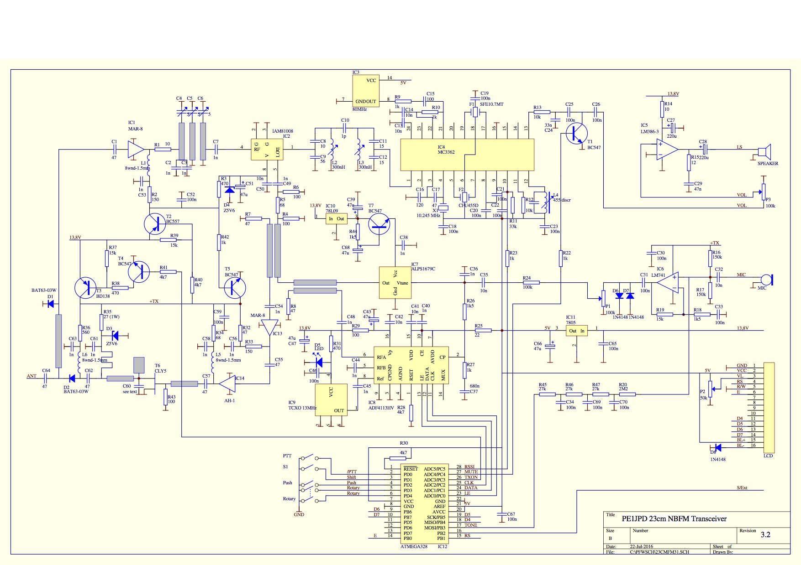

# 23cm NBFM transceiver

An open source 23cm narrow band FM transceiver.

KiCad format, optimized for JLCPCB.

Status: Schematic under active definition, not yet complete.

## Background

Prompted by a presentation by Richard (VK2VD) at Amateur Radio NSW on the 28th of July, 2024, this repository attempts to provide a design including all KiCad source files representing a derivative of the design by Bas de Jong (PE1JPD) with later firmware updates by Werner Mauser (JN48OL).

Various changes have been made to the design, outlined below.

## Original design details

Bas de Jong (PE1JPD)'s [original project page](http://www.pe1jpd.nl/index.php/23cm_nbfm/) describes the overall design, made in 2015, notably including this 2016 revised schematic.

Werner Mauser (JN48OL)'s [forked repository](https://github.com/wemaus/23cm-NBFM-Trx) provides firmware improvements, notably including a further revised schematic redrawn in KiCad 3.0.

 

## Changes from prior versions

 * __Amplifier__: Maintained 2 x MAR-8 series amplifiers per original design, noting alternatives generally present worse noise performance, lower gain, and are footprint incompatible.
 * __Components__: Focus on SMT components available in 2024. Generally prefer to over-specify components where economically insignificant to increase tolerance and longevity.
 * __Display__: Migrate the LCD to an I2C interface. Nominally opens up I2C for other peripherals and features. Much neater in terms of simplifying the schematic. Allows more flexibility in mechanical design/interface mounting. Necessitates re-allocating `MUTE` and `RSSI` to alternate pins, plus software changes. Necessitates off-board module and cable. Programmable backlight with MCU control, and one less knob. User retains option for manual adjustment using module-supplied jumper and internal potentiometer.
 * __MCU__: Use an MCU module (Arduino Nano v3) instead of a bare chip in order to reduce cost, increase convenience, support USB programming, and focus the schematic on the application.
 * __Power supply__: Drop 13.8V DC 'charged lead acid battery level' input to support a modern supply voltage (24V) and include a regulator with high current support.
 * __Schematic__: Emphasize legibility through reducing cognitive load with block-based / modular schematic. Use named labels instead of single page all-in-one view with crossed nets.

## Contents

 * __docs__: Design documentation.
 * __firmware__: Currently unaltered firmware from Werner Mauser (JN48OL).
 * __23cm-trx-kicad__: KiCad project directory for the 23cm transceiver.
