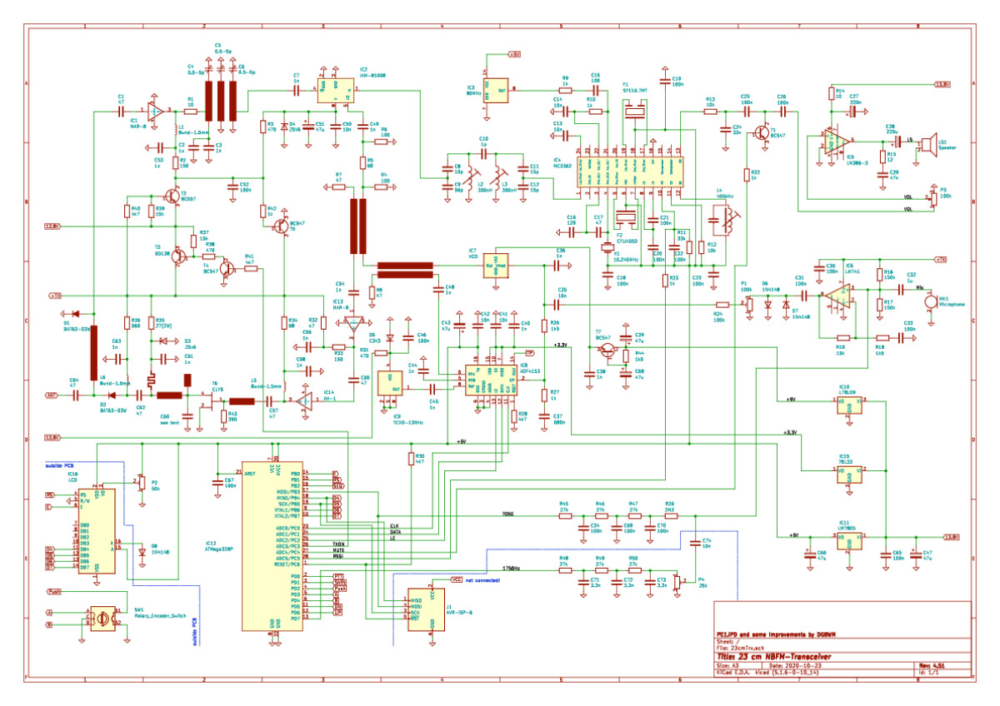

# 23cm NBFM transceiver

An open source 23cm narrow band FM transceiver.

[KiCad](https://www.kicad.org/) format, optimized for building with [LCSC](https://www.lcsc.com/) and [JLCPCB](https://www.jlcpcb.com/).

Status: Schematic under active redefinition, BOM largely verified, firmware converted to platformio and compiling, some required symbols drawn, schematic as yet incomplete and revised layout not yet begun. Some mechanical design work and supply chain research completed. Getting bogged down in theory but learning a lot. Modeled some subsystems.

## Background

Prompted by a presentation by Richard (VK2VD) at Amateur Radio NSW on the 28th of July, 2024, this repository attempts to provide a design including all KiCad source files representing a derivative of the design by Bas de Jong (PE1JPD) with later firmware updates by Werner Mauser (JN48OL).

Various changes have been made to the design, outlined below.

## Original design details

Bas de Jong (PE1JPD)'s [original project page](http://www.pe1jpd.nl/index.php/23cm_nbfm/) describes the overall design, made in 2015, notably including this 2016 revised schematic.

Werner Mauser (JN48OL)'s [forked repository](https://github.com/wemaus/23cm-NBFM-Trx) provides firmware improvements, notably including a further revised schematic redrawn in KiCad 3.0.

 

## Changes from prior versions

 * __Amplifier__: Maintained 2 x MAR-8 series amplifiers per original design, noting alternatives generally present worse noise performance, lower gain, and are footprint incompatible.
 * __Buses__: The "SPI compatible" bus on the ADF4153 was moved to the standard ports. The I2C bus was added to support the new display module and other expansion.
 * __Components__: Near complete reselection with a focus on SMT components available in 2024. General preference to over-specify components where economically insignificant to increase tolerance and longevity.
 * __Display__: Migrate the LCD to an I2C interface. Nominally opens up I2C for other peripherals and features. Much neater in terms of simplifying the schematic. Allows more flexibility in mechanical design/interface mounting. Necessitates re-allocating `MUTE` and `RSSI` to alternate pins, plus software changes. Necessitates off-board module and cable. Programmable backlight with MCU control, and one less knob. User retains option for manual adjustment using module-supplied jumper and internal potentiometer.
 * __Filters__: [Explicitly modeling](docs/filter-models/) each filter network encountered.
 * __Firmware__: Now compiles with [platformio](https://piolabs.com/).
 * __MCU__: Use an MCU module (Arduino Nano v3) instead of a bare chip in order to reduce cost, increase convenience, support USB programming, and focus the schematic on the application.
 * __Power supply__: Drop 13.8V DC 'charged lead acid battery level' input to support a modern supply voltage (24V) and include a regulator with high current support.
 * __Schematic__: Completely redrawn to emphasize legibility through reducing cognitive load with block-based / modular schematic. Use named labels instead of single page all-in-one view with crossed nets. Hopefully still works!
 * __VCO__: Neither of the VCOs mentioned seem to be obtainable. A shortlist of potential replacements has been gathered. No doubt voltage levels on both the supply and tuning sides will need adjustment in order to integrate.
   * M1200 (+0-5V = 1150-1350MHz) - 6RMB @ [Manufacturer](https://www.fresend.com/productinfo/647892.html)
   * RFINT INNOTION YSGM 111308 (+0.5-4.5V = 1100-1350MHz, nominal 1050-1400MHz support) - $1.14 @ [AliExpress](https://www.aliexpress.com/item/1005005589982171.html)
   * FDK IR013 (1200-1400MHz) - $1.08 @ [AliExpress](https://www.aliexpress.com/item/1005007461973192.html)
   * UCVE1-W05A (marked "A041"; 1200-1670MHz) - $0.89 @ [AliExpress](https://www.aliexpress.com/item/1005005589963281.html)
   * MURATA MQW540A1G40R6 (1200-1600MHz) - $1.73 @ [AliExpress](https://www.aliexpress.com/item/1005007376224853.html)
   * MARUWA MVE-1377 (marked "E1377"; 1200-1400MHz) - $1.73 @ [AliExpress](https://www.aliexpress.com/item/1005007372058424.html)
   * ENFVH1D2SA4 (marked "12 VHA4"; 1200-1400MHz) - $2.16 @ [AliExpress](https://www.aliexpress.com/item/1005007376529487.html)

## Contents

 * __docs__: Design documentation. Some interesting stuff in here.
 * __firmware__: Currently unaltered firmware from Werner Mauser (JN48OL) converted to compile with platformio.
 * __23cm-trx-kicad__: KiCad project directory for the 23cm transceiver.
