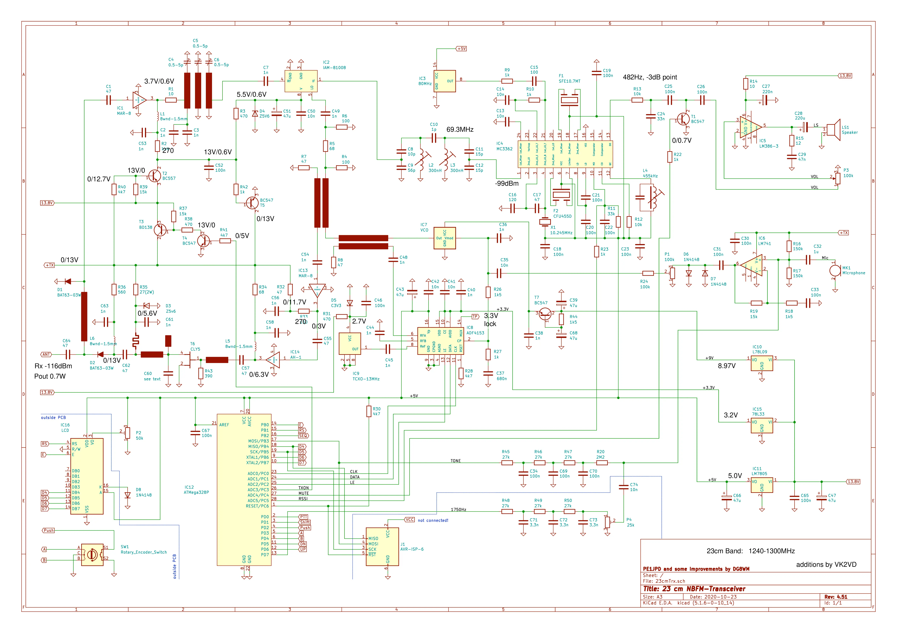
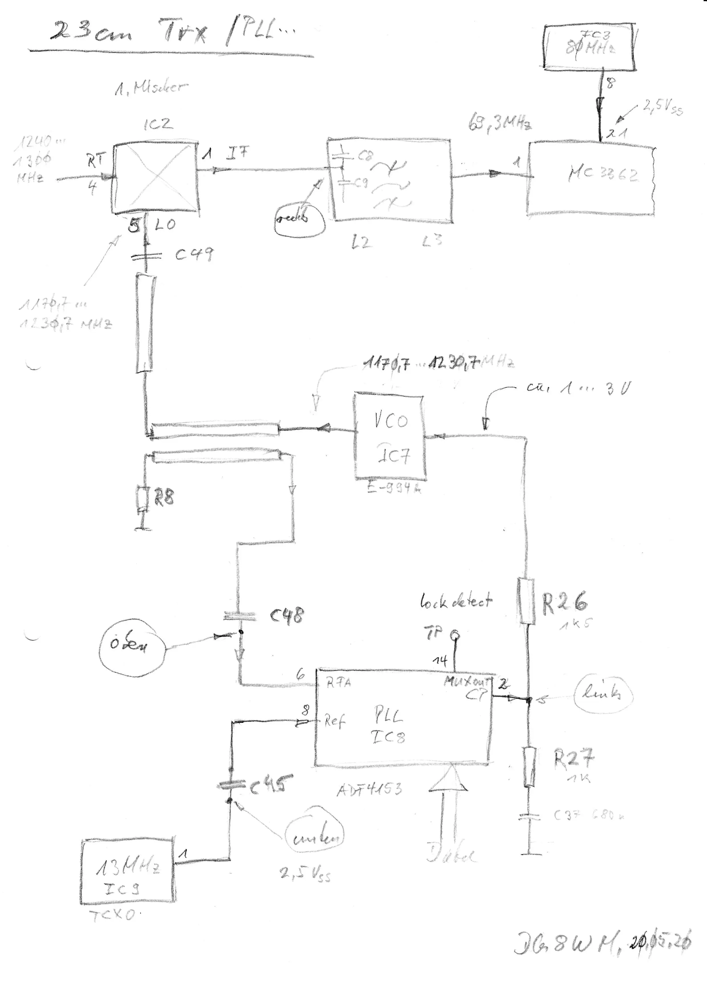

# Extra resources from VK2VD

VK2VD was kind enough to send me some further information.

First, he provided some English translations of stages 2 and 3 of [Wemaus' build site](http://www.mdtweb.de/index.php/projekte/nachrichtentechnik/nachrichtengeraete/23-cm-fm-transceiver/). I have not included those here in the repository because you can easily generate your own translations using [translate.google.com](https://translate.google.com) or similar services and being docx files with images they were relatively large.

Second, he provided a higher resolution version of his revised schematic which incorporates his suggested fixes to thermal issues observed with the previous schematic.

Finally, he provided the following Sketch by DG8WM showing the PLL system.

