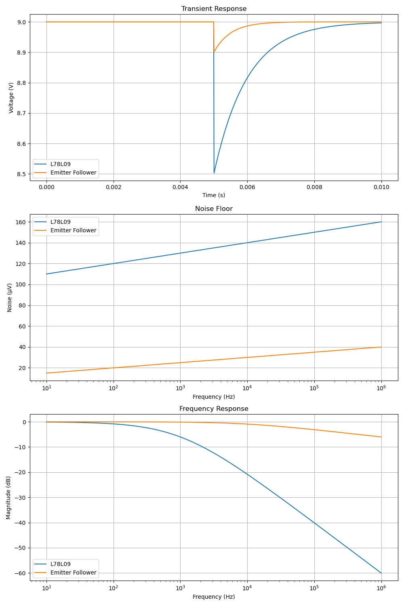
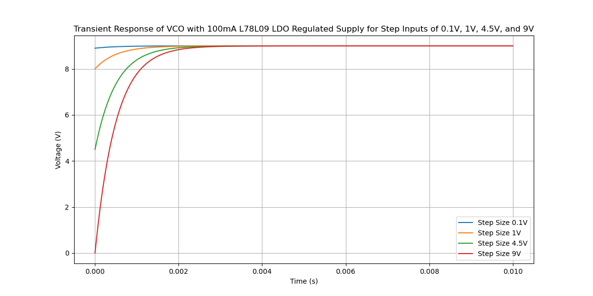

# 9V Emitter Follower Buffer

This circuit provides stability and noise immunity for the VCO supply.

Here you can see the benefit of the circuit vs. a direct supply connection from the 9V LDO to the VCO VCC pin.

Without a buffer filter, the following step response would be expected.

The impact of various buffer filter capacitor values are modeled here.

