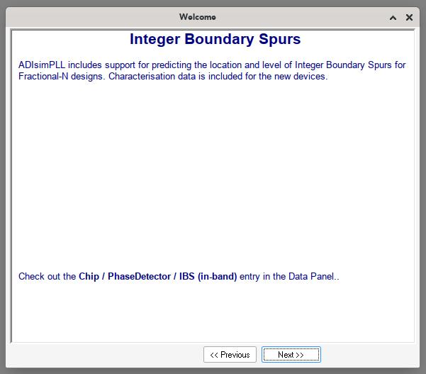
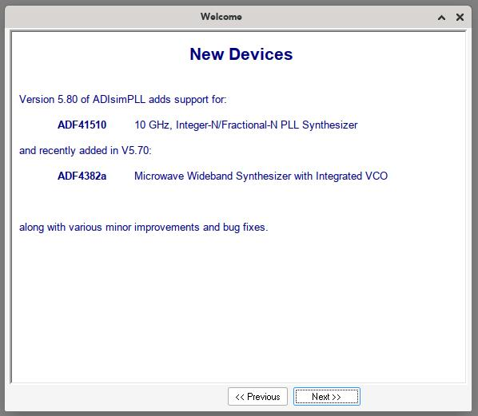
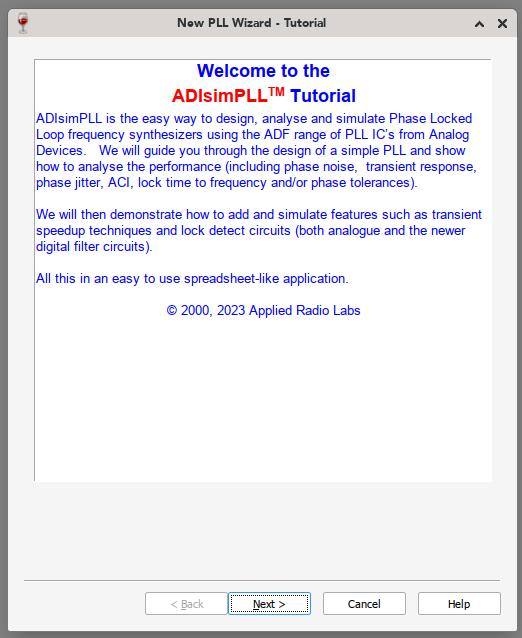

# PLL Design Tool

The tool recommended by the manufacture of the PLL synthesis chip is [ADIsimPLL](https://www.analog.com/en/lp/resources/adisimpll.html).

## Download and install

The tool is designed for Windows but can be downloaded under Linux and run under [wine](https://www.winehq.org/).

The direct download script is as follows:

```
wget https://www.analog.com/media/en/engineering-tools/design-tools/adisimpll_v5_80_01_setup.zip && \
unzip adisimpll_v5_80_01_setup.zip && \
cd adisimpll_v5_80_01_setup && \
wine64-vanilla-9.0 ADIsimPLL_V5_80_01_setup.exe
```

Note that your `wine` instllation may required a slightly different binary name when executing the final command.

On any modern Linux, press `wine<tab><tab>` to see a list of contenders.

## Running the tool

Under Linux you can run the following command to start ADIsimPLL after installation.

```
wine64-vanilla-9.0 'c:\program files (x86)\applied radio labs\adisimpll ver 5.80\bin\simpll_ad.exe'
```

### Making things easier

There may be a better way to do this but I'm not a regular wine user.

Given this command line is a hassle to type, if you want to run this more than once you can create an alias like this:
```
alias adisimpll="wine64-vanilla-9.0 'c:\program files (x86)\applied radio labs\adisimpll ver 5.80\bin\simpll_ad.exe'"
```

Store than in your `~/.bashrc` (or other shell initialization file) in order to make it permanent.

You will now be able to run the tool by typing `adisimpll`.

## Notes

The software includes general rule-of-thumb characterisations of different filter designs which are presumably well founded.

## Tips

There is an interesting `tips.txt` file included with the software. A lot of it is marketing or irrelevant but some of the more interesting portions include:

 * You can measure the tuning data for a VCO (presumably a table of known input voltages vs. observed output oscillation frequencies), then store it in the system to model.
 * The ADF4116, ADF4117 and ADF4118 are pin compatible,  lower phase noise replacements for the LMX2306, LMX2316 and LMX2326 single devices respectively.   Drop-in replacements for the LMX dual devices are also available. The ADF4116, ADF4117 and ADF4118 devices use fixed prescalers and can operate up to 3.0GHz.   The ADF4110 through ADF4113 single PLL devices (and ADF4210 through ADF4213 dual PLL devices) allow control of prescaler division ratio and can operate up to 4.0GHz.
 * There is a reference doubler on-chip in all the ADF4000 series Fractional-N models. This allows the input reference signal to be doubled. This is useful for increasing the PFD comparison frequency. Making the PFD frequency higher improves the overall PLL system noise performance. Doubling the PFD frequency will usually result in an improvement in noise performance of 3dB.
 * For certain designs sourcing high performance clock devices is desirable in order to reduce jitter.
 * ADF4110 through ADF4113 single PLL devices (and ADF4210 through ADF4213 dual PLL devices) allow control of prescaler division ratio over the range 8/9, 16/17, 32/33 and 64/65. Minimizing the prescaler division ratio allows the phase detector to run at higher frequencies without missing channels, reducing phase noise and accelerating switching times. However, be sure to ensure that the highest output frequency from the prescaler does not exceed the Maximum Allowable Prescaler Output Frequency specified on the datasheet: ADI SimPLL automatically checks this.

## Screenshots




